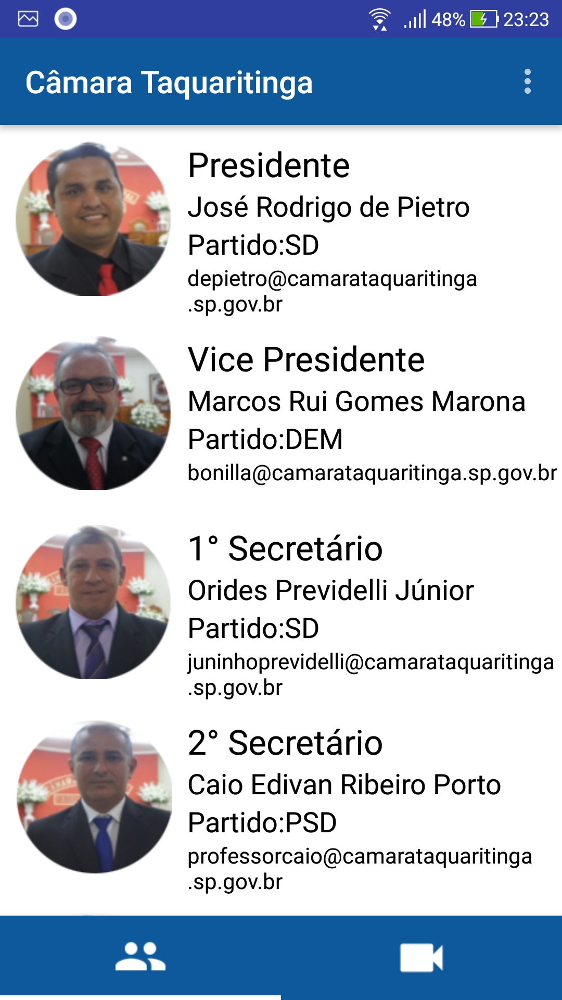

# AppCamaraTaquaritinga-Android

Projeto desenvolvido individualmente.

Desafio e-camara 

Aplicativo vencedor em 1° lugar do desafio da Fatec Taquaritinga 

O aplicativo permite fazer cadastro do usuário e ao cadastrar, envia um e-mail de confirmação de cadastro para o usuário.
Caso o usuário esqueça a senha, tem a opção de recuperação de senha. Possibilita fazer o login com o facebook, assistir a stream da câmara de taquaritinga, enviar e-mail  com a biblioteca javamail para os vereadores e ouvidoria da câmara, no corpo do e-mail, acompanha o nome do usuário logado e o e-mail, ou seja, quando o usuário enviar o e-mail, não é necessário o usuário escrever o próprio e-mail para contato, o aplicativo anexa automaticamente os dados do usuário logado dentro do corpo do e-mail que será enviado.

Tecnologia utilizada:

* Java
* Firebase

Para visualizar o código fonte

app/src/main/java/com/camarataquaritinga/projeto/camarataquaritinga/

O aplicativo encontra-se na pasta  " bin "  para download.

Screenshots do aplicativo
 
   

